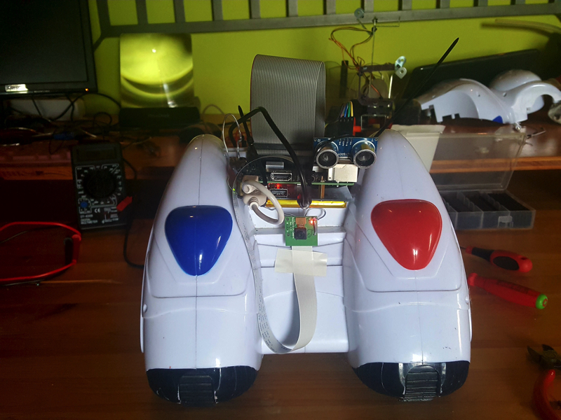

## Phil05

This is a demo project aimed to give life to an old toy, implanting a raspberrypi inside.



## Demo Video

[](http://www.youtube.com/watch?v=dWwAfJSV2rI "Demo Video")

## Hardware

The hardware I used for this project is:
- [Old motorized toy](http://amzn.to/2redi0O)
- [RaspberryPi 3 model b](http://amzn.to/2sqIQ19)
- [Lithium Battery Pack Expansion Board](http://amzn.to/2qJ58dh)
- [UltraSonic module hc-sr04](http://amzn.to/2qJ7poG)
- [L298 Dual H-Bridge Motor Driver (DC and Stepper Motors)](http://amzn.to/2regAB3)
- [Raspicam](http://amzn.to/2sqLEvf)
- breadboard
- a bunch of wires

## Software

The software runs on a Raspbian 8 (jessie). The code is developed in nodejs, a promising, popular and fast serverside version of javascript. It just contains two sub-project: 
- a manual driving via keyboard
- an autopilot test code using the sonar

## Installation

```bash
git clone https://github.com/dynamick/phil05
cd phil05
sudo npm install
```

Make sure to have [motion](http://pingbin.com/2012/12/raspberry-pi-web-cam-server-motion/) up and running so you could see what raspicam is viewing in real-time.

## Running

You could choose the manual driving mode launching:
```bash
sudo npm run manual
```

... or you could try the autopilot using:
```bash
sudo npm run autopilot
```

... or you could lauch both on two console to ibrid command your robot.


